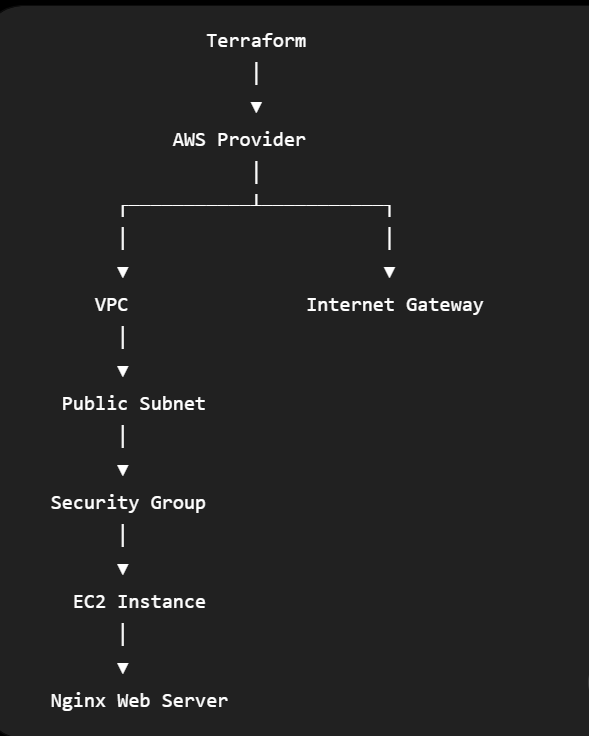

# 🚀 AWS Infrastructure Automation using Terraform

## 📌 Project Overview

This project demonstrates how to provision AWS infrastructure using **Terraform (Infrastructure as Code)**. Instead of manually creating AWS resources, the complete infrastructure is automated using Terraform configuration files.

The project provisions a complete networking environment along with an EC2 instance running an Nginx web server.

---

## 🏗️ Architecture Diagram

<p align="center">
  
</p>

---

## 🏛️ Architecture Components

- Amazon VPC
- Public Subnet
- Internet Gateway
- Route Table
- Security Group
- EC2 Instance
- Nginx Web Server

---

## 📂 Project Structure

```text
terraform-aws-ec2-project/
│
├── architecture/
│   └── architecture.png
│
├── docs/
│   ├── commands.md
│   ├── interview-questions.md
│   └── troubleshooting.md
│
├── screenshots/
│
├── userdata/
│   └── install-nginx.sh
│
├── provider.tf
├── variables.tf
├── terraform.tfvars
├── vpc.tf
├── subnet.tf
├── igw.tf
├── route-table.tf
├── security-group.tf
├── ec2.tf
├── outputs.tf
├── .gitignore
└── README.md
```

---

## 🚀 Technologies Used

- Terraform
- AWS EC2
- AWS VPC
- AWS Internet Gateway
- AWS Route Table
- AWS Security Group
- Amazon Linux 2
- Nginx
- Git
- GitHub

---

## ⚙️ Terraform Commands

```bash
terraform init
terraform fmt
terraform validate
terraform plan
terraform apply
terraform destroy
```

---

## 📸 Project Screenshots

Project screenshots are available in the **screenshots/** folder.

---

## 📚 Documentation

The project includes detailed documentation:

- Commands Reference
- Interview Questions
- Troubleshooting Guide

All documentation is available inside the **docs/** folder.

---

## 🎯 Learning Outcomes

During this project, I learned:

- Infrastructure as Code (IaC)
- Terraform Basics
- AWS Networking
- EC2 Provisioning
- Security Groups
- User Data Automation
- Terraform State Management
- Git & GitHub Workflow
- Infrastructure Troubleshooting

---

## 👩‍💻 Author

Kanchan 

Aspiring DevOps Engineer

---

⭐ If you found this project helpful, feel free to star this repository.